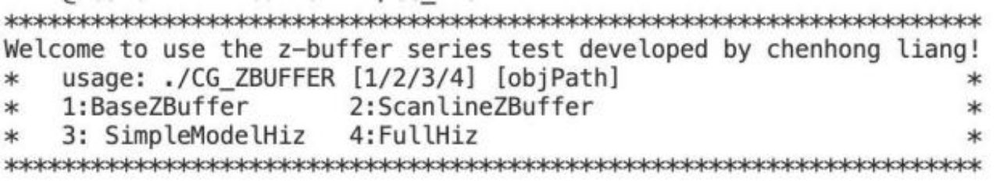
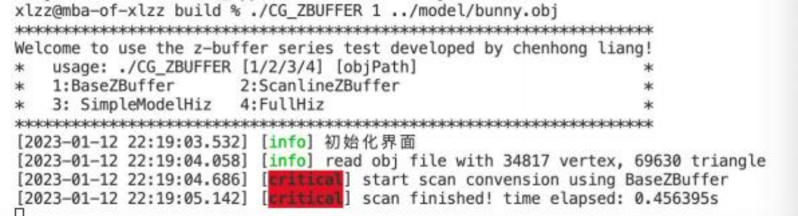
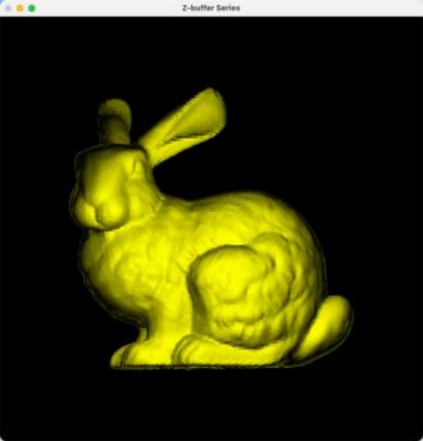
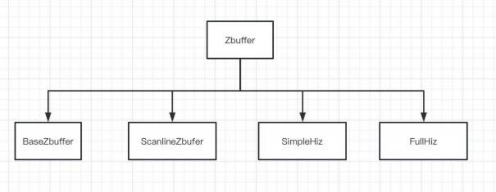
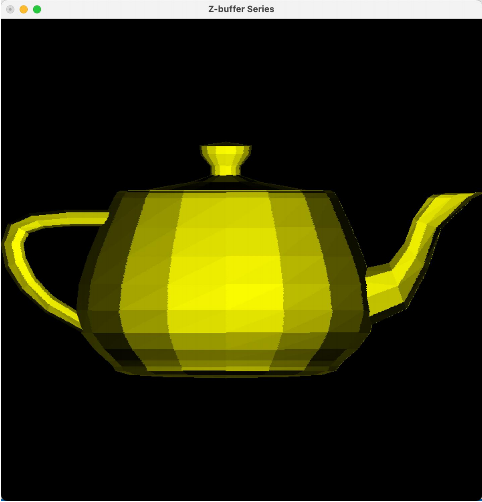
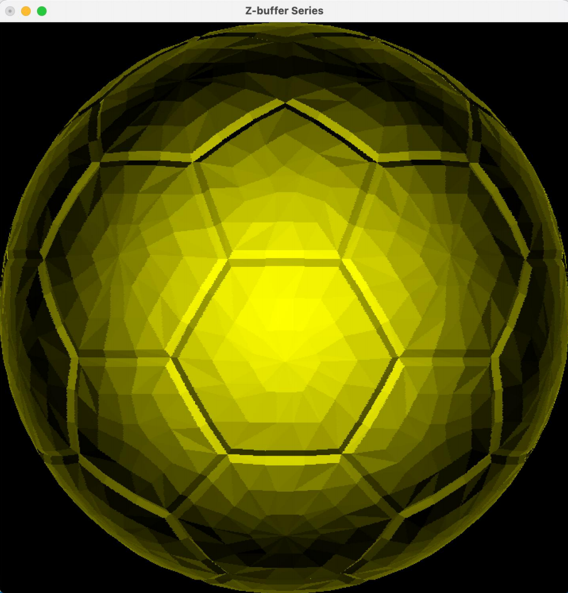
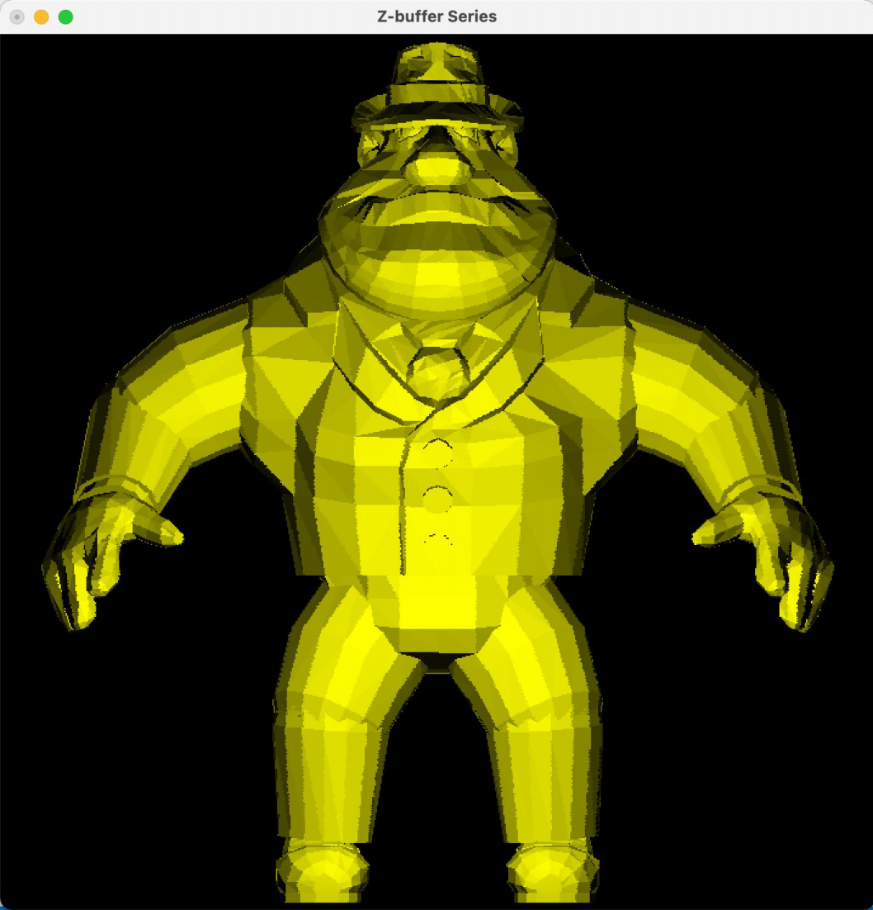
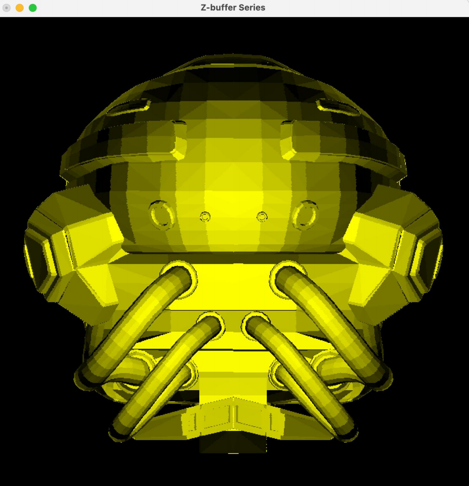
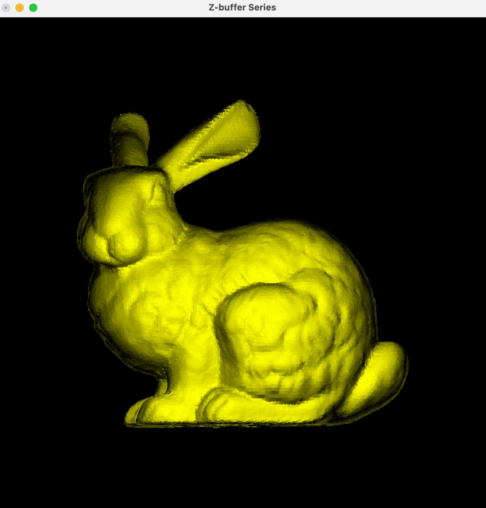
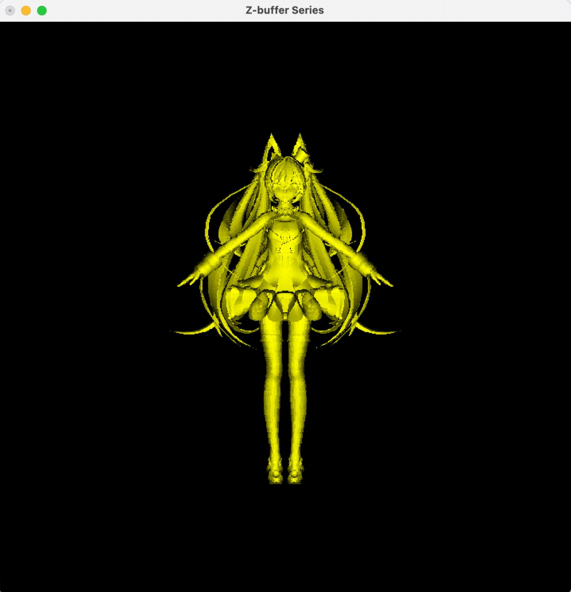

# ZBuffer

## 简介

## 开发环境

除了标准的 C++库外，  本项目使用了如下第三库：
- OpenGL 、Glut  ( Linux 系统得额外需要 GLEW)  ：用于简单的跨平台图形显示。
- Eigen3：作为几何处理的必用库之一，  在本项目中用于一些矩阵和向量计算，以及一些底层数据的表示。
- Spdlog：用于控制台输出日志，  在本项目中用于输出各种算法的提示和花费时间。
- igl: 几何处理的常用库，本项目使用其带读取 obj 等格式的三维数据文件。
- OpenMP：典型的 c++并行计算加速库，  在本实验中对于一些可以并行计算的 for 循环使用 了该库以进行适当的加速。

## 使用说明

例如:
./CG_ZBUFFER 1 ../model/bunny.obj，此时界面如下：
会提出现在正在使用 BaseZBuffer 算法进行扫描转化，并且自动输出了所花费的时间。

与此同时，弹出如下绘制的窗口：

## 代码说明
代码的头文件放在 include 下面，  源文件放在 src 下面，  主要框架如下：

- Zbuffer：抽象虚基类，所有子类必须实现 scan()方法。
- BaseZbuffer：最基本的 Zbuffer 算法，遍历物体实现扫描，没有利用景物和图形空间的相关性，并且需要与图片分辨率一致的深度缓存。
- ScanlineZbuffer：将缓存需求降低为一行，并且基于边的平滑过渡性实现了利用简单的加减法更新深度值。
- SimpleHiz：  简单模式的层次 zbuffer，通过在图像空间的深度缓存构建四叉树结构，能够达到“快速拒绝”一部分物体的效果。
- FullHiz：完全模式的层次 zbuffer，在简单模式之外，在景物空间建立八叉树。
类似于光线追踪算法利用了景物空间的相关性，进一步促成更多的“快速拒绝”。

### 数据结构说明
- Vertex：顶点类，是 Eigen::RowVector3d 的代名词。
- Edge：边类，维护上端点的x，y，z和变化信息。
- Polygon：多边形类，拥有三条边，维护最大x，y，z及其变化信息。                   
- ActiveEdge：活化边表类，相当于是上端点可以变化的 Edge。
- ActivePolygon：始终维护左右两条活化边，随着扫描线变化而不断更新。             
- Segement：代表当前扫描线与活化多边形相交的夹在两条活化边之间扫描线片
- AABB：层次包围盒，表示八叉树节点或者四叉树节点。
- QuadTree：表示四叉树 zbuffer 的四叉树类，拥有四叉树节点 。
- QuadTreeNode。(QuadZbuffer：  为了加速实现的基于循环而非递归的四叉树类)
- Octree：表示物体八叉树的类，用于八叉树节点。
### 其他文件
- Model：  表示读取后的 Obj 文件。
- Utils.h：  记录系统时间。

# 运行结果
## 原始文件
| 模型文件(obj) | 顶点数 | 面片数目 |
| ------------- | ------ | -------- |
| cube          | 8      | 12       |
| teapot        | 530    | 992      |
| soccerball    | 1760   | 3516     |
| al            | 3618   | 7124     |
| helmet        | 14556  | 15452    |
| bunny         | 34817  | 69630    |
| miku          | 103683 | 174514   |

## 算法时间
| 算法\模型（时间:s） | cube     | teapot   | soccerball | al       | helmet   | bunny    | miku     |
| ------------------- | -------- | -------- | ---------- | -------- | -------- | -------- | -------- |
| BaseZbuffer         | 0.554379 | 0.11918  | 0.404316   | 0.291719 | 0.487461 | 0.461733 | 0.500453 |
| ScanlineZbuffer     | 0.166950 | 0.087226 | 0.253735   | 0.192333 | 0.327541 | 0.541419 | 0.858593 |
| SimpleHiz           | 2.403519 | 0.828399 | 2.166604   | 1.640189 | 2.549220 | 2.227868 | 2.153695 |
| FullHiz             | 2.425328 | 0.861603 | 2.319838   | 1.800215 | 2.823617 | 2.854190 | 3.117259 |

## 渲染示例
### Teapot

### Soccerball

### Al

### Helmet

### Bunny

### Miku

